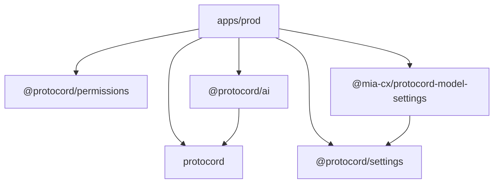
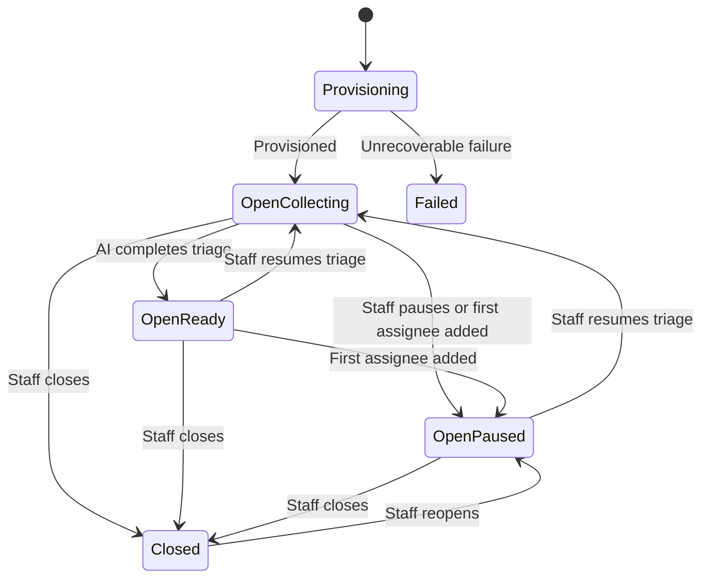

# Prod Discord Ticketing Bot MVP

GitHub tracking: [PRD #1](https://github.com/mia-cx/prod/issues/1), with implementation slices represented as native sub-issues and sequencing represented through native `blocked by` relationships.

## Summary

Build Prod as a multi-guild Discord ticketing bot for the Poke Community support workflow.

The MVP will provide:

- `/issue`, `/report`, and `/debugshare` aliases for opening tickets.
- An empty support hub with one informational message and invite-only private ticket threads.
- AI-assisted information gathering that stops when triage completes or staff takes over.
- Multiple assignees per ticket.
- Self-assignment through `/claim` and `/unclaim`.
- Delegated assignment through `/assign` and `/unassign`.
- AI-generated assignee suggestions without autonomous assignment.
- Staff-only labels, assignments, internal summaries, and ticket queues.
- An embedded context-subject-object-verb-permit authorization system.
- A Components v2 settings UI using combined Discord mentionable selects for users and roles.
- OpenRouter model configuration and encrypted guild BYOK.
- Protocord: a componentized Discord.js action framework with first-party AI, permissions, and settings extensions.
- `@mia-cx/protocord-model-settings`: a reusable Components v2 model-settings implementation built on `@protocord/settings`, but not shipped as first-party Protocord.
- A pnpm workspace orchestrated by Turborepo.
- SQLite persistence, audit history, Docker, Compose, Kubernetes, Helm, and CI.

Prod will not use OpenFGA or another external authorization service. External ticket forwarding and knowledge-base ingestion are deferred.

## 1. Project foundation

Scaffold an independent service rather than creating a runtime dependency on Patch or Honeybot.

Reuse and adapt:

- Patch's canonical action/trigger registry, Discord dispatcher, model tool exposure, availability checks, and conflict validation.
- Honeybot's Components v2 settings builder, SQLite/Drizzle patterns, `ModelStore`, AES-256-GCM BYOK encryption, deployment files, and CI conventions.

Use:

- Node 24
- TypeScript ESM
- pnpm workspaces
- Turborepo for task ordering, parallelism, and caching
- discord.js 14
- Effect schemas for environment, action input, model output, and persisted-domain validation
- Drizzle ORM with `better-sqlite3`
- Vitest
- ESLint and Prettier
- Structured logging with secrets redacted

Prod begins as a monorepo. Protocord and Mia CX package identities are deliberate, but every workspace package remains private until publishing and repository extraction are evaluated after the MVP. Prod-specific application and tooling packages retain the `@prod/*` scope.

Repository layout:

```text
apps/
  prod/
    src/
      actions/
    prompts/
      triage-system.md
    drizzle/
    package.json

packages/
  protocord/
  protocord-ai/
  protocord-permissions/
  protocord-settings/
  protocord-model-settings/
  config-eslint/
  config-typescript/

docker/
k8s/
charts/prod/
package.json
pnpm-workspace.yaml
pnpm-lock.yaml
turbo.json
```

Workspace declaration:

```yaml
packages:
  - "apps/*"
  - "packages/*"
```

Package dependency direction:



`@mia-cx/protocord-model-settings` is an independent consumer of the Protocord settings contract. It is not part of the first-party `@protocord/*` package family.

Rules for deep, extractable packages:

- No package imports from `apps/prod`.
- No relative filesystem imports across package boundaries.
- Every package has its own `package.json`, TypeScript configuration, explicit `exports`, build, typecheck, lint, and boundary-test scripts.
- Use compiled `dist` packages rather than exporting raw TypeScript.
- Workspace dependencies use `workspace:*`.
- Packages own their schemas and migrations where they persist data; the Prod app invokes package migrations in a fixed startup order.
- Third-party boundaries remain behind package adapters.
- Integration glue belongs in `apps/prod` unless one package is intentionally a consumer of another, as with `@mia-cx/protocord-model-settings` consuming `@protocord/settings`.
- Keep Protocord focused on composable Discord action and interaction contracts; do not turn it into a shared-utils package or move Prod domain behavior into it.
- CI runs a package packing smoke test so each reusable package can eventually be extracted without source rewrites.

Root scripts delegate to Turbo:

```json
{
  "scripts": {
    "build": "turbo run build",
    "dev": "turbo run dev",
    "lint": "turbo run lint",
    "typecheck": "turbo run typecheck",
    "test": "turbo run test",
    "check": "turbo run lint typecheck test build",
    "pack:check": "turbo run pack:check"
  }
}
```

Initial `turbo.json` tasks:

```json
{
  "$schema": "https://turbo.build/schema.json",
  "tasks": {
    "build": {
      "dependsOn": ["^build"],
      "outputs": ["dist/**"]
    },
    "lint": {
      "outputs": []
    },
    "typecheck": {
      "dependsOn": ["^build"],
      "outputs": []
    },
    "test": {
      "dependsOn": ["^build"],
      "outputs": ["coverage/**"]
    },
    "pack:check": {
      "dependsOn": ["build"],
      "outputs": []
    },
    "dev": {
      "cache": false,
      "persistent": true
    },
    "clean": {
      "cache": false
    },
    "db:generate": {
      "cache": false
    },
    "db:migrate": {
      "cache": false
    },
    "commands:register": {
      "cache": false
    },
    "deploy": {
      "dependsOn": ["build"],
      "cache": false
    }
  }
}
```

pnpm remains responsible for packages, dependency resolution, workspace linking, filtering, and the lockfile. Turbo is only the task graph and cache. Database migrations, Discord command registration, deployment, development watchers, and other side-effectful tasks are never cached.

## 2. Ticket space and Discord permissions

Each guild configures one text channel as its support hub.

The hub follows an "empty hub" privacy contract:

- The bot may maintain one informational message explaining the channel and issue commands.
- No ticket content is posted in the hub.
- Reporters cannot send messages or create threads in the hub.
- When a reporter has at least one open ticket, their channel overwrite allows:
  - `ViewChannel`
  - `ReadMessageHistory`
  - `SendMessagesInThreads`
  - `UseApplicationCommands`
- Their overwrite explicitly denies:
  - `SendMessages`
  - `CreatePublicThreads`
  - `CreatePrivateThreads`
- Prod creates a private thread and explicitly adds the reporter.
- Staff access private threads through `ManageThreads` or explicit membership.

The parent must permit message history because private threads inherit parent permissions. Privacy comes from keeping the hub free of ticket traffic and using invite-only private threads. [Discord thread permissions](https://docs.discord.com/developers/topics/threads)

Required bot permissions:

- View channels
- Manage channel permission overwrites
- Create private threads
- Manage threads
- Send messages
- Send messages in threads
- Read message history
- Use application commands
- Embed links

Gateway intents:

- Guilds
- Guild members
- Guild messages
- Message content

## 3. Ticket creation and recovery

The canonical `create_ticket` action has three slash triggers and equivalent optional prefix-text triggers:

- `/issue [summary]`
- `/report [summary]`
- `/debugshare [summary]`
- `<prefix>issue [summary]`
- `<prefix>report [summary]`
- `<prefix>debugshare [summary]`

All accept the same optional short summary and record the originating alias.

Creation sequence:

1. Validate guild context, configured hub, reporter membership, and bot permissions.
2. Insert a `provisioning` ticket with a generated stable ID.
3. Ensure the reporter's shared hub overwrite exists.
4. Create a private thread named with the short ticket ID and sanitized summary.
5. Add the reporter as a thread member.
6. Post deterministic opening instructions:
   - Confirm the supplied summary, if any.
   - Explain that the reporter should send `DEBUGSHARE` to Poke and paste Poke's response.
   - Ask what happened, what was expected, and for relevant reproduction context.
7. Persist the thread ID and mark the ticket open.
8. For slash commands, reply ephemerally with the thread link. For text commands, reply with a minimal thread link that auto-deletes after 30 seconds; the private thread remains inaccessible to other users.

Multiple open tickets per reporter are allowed.

On partial failure:

- Delete the newly created thread when possible.
- Remove the reporter overwrite only if they have no other open ticket.
- Mark the ticket `failed`.
- Record failure and compensation results in the event log.
- Return an ephemeral, actionable error.

At startup, reconcile stale `provisioning` tickets by inspecting their Discord resources. Complete safe recoveries; otherwise compensate and mark them failed.

## 4. Ticket lifecycle

Ticket lifecycle and AI triage are orthogonal:

```ts
type TicketStatus = "provisioning" | "open" | "closed" | "failed";
type TriageStatus = "collecting" | "ready" | "paused";
```

Assignment is not a status.



Rules:

- Adding the first assignee pauses triage.
- Adding further assignees does not change triage state.
- Removing the final assignee does not automatically resume triage.
- Reopening restores the ticket with triage paused.
- Staff must explicitly run `/triage resume` to restart AI.
- Closing the reporter's final open ticket removes their hub overwrite.
- If other tickets remain open, retain the shared overwrite.
- Reopening restores the overwrite when necessary.

## 5. Multiple assignees

Tickets support any number of assignees.

Commands:

```text
/claim [ticket]
/unclaim [ticket]
/assign user:<user> [ticket]
/unassign user:<user> [ticket]
```

Behavior:

- `/claim` adds the invoking staff member as an assignee.
- `/unclaim` removes the invoking staff member.
- `/assign` adds another eligible staff member.
- `/unassign` removes another assignee.
- Operations are idempotent.
- `/assign` and `/unassign` require delegated-assignment permission.
- The target of `/assign` must be allowed `claim_self` on the ticket object.
- Assignment metadata remains staff-only.

When no ticket argument is supplied, infer it from the current thread. Outside a ticket thread, require a ticket ID with autocomplete.

Persistence:

```text
ticket_assignees
  ticket_id
  user_id
  assigned_by_type
  assigned_by_id
  created_at

  PRIMARY KEY (ticket_id, user_id)
```

AI suggestions are also many-to-many:

```text
ticket_assignee_suggestions
  ticket_id
  user_id
  reason
  active
  created_at
  updated_at

  PRIMARY KEY (ticket_id, user_id)
```

AI may suggest multiple eligible staff members but cannot assign them in the MVP.

## 6. Embedded fine-grained authorization

Implement `@protocord/permissions` in `packages/protocord-permissions` as a local context-subject-object-verb-permit engine backed by consumer-provided SQLite storage. Prod embeds it in-process; there is no external authorization process or datastore.

### Context, subject, object, verb, and permit

Authorization is modeled as five independent dimensions:

```text
context + subject + object + verb -> permit
```

The context describes the complete Discord location where a check or rule applies. `guildId` is always required; category and channel refine that guild context when present. None of these identifiers are encoded in an authorization subject or object.

```ts
type AuthorizationContext = {
  guildId: string;
  categoryId?: string;
  channelId?: string;
};

type AuthorizationSubject =
  | {
      subjectType: "user";
      subjectId: string;
      attributes: {
        discordRoleIds: readonly string[];
        isGuildOwner: boolean;
        isAdministrator: boolean;
      };
    }
  | {
      subjectType: "service";
      subjectId: "prod-ai";
    };

type AuthorizationObject =
  | { objectType: "ticket"; objectId: string }
  | { objectType: "queue"; objectId: "*" }
  | { objectType: "settings"; objectId: "*" }
  | { objectType: "permissions"; objectId: "*" };

type AuthorizationCheck = {
  context: AuthorizationContext;
  subject: AuthorizationSubject;
  object: AuthorizationObject;
  verb: PermissionVerb;
};
```

A Discord user expands internally into exact-user, role, and everyone rule selectors. A service expands only to its exact service selector. Runtime subjects and stored rule selectors remain separate types:

```ts
type RuleSubject =
  | { subjectType: "user" | "role" | "service"; subjectId: string }
  | { subjectType: "everyone"; subjectId: "*" };

type RuleObject = {
  objectType: AuthorizationObject["objectType"];
  objectId: string; // exact resource ID or "*"
};

type PermissionRule = {
  id: string;
  context: AuthorizationContext;
  subject: RuleSubject;
  object: RuleObject;
  verb: PermissionVerb;
  permit: "allow" | "deny";
  createdByUserId: string;
  createdAt: string;
  updatedAt: string;
};
```

Discord adapters must construct user subjects and authorization contexts from current Discord objects. They must verify that the member and resource belong to `context.guildId`, that an optional category belongs to that guild, and that an optional channel belongs to that guild and category when both are present. Actions must not manually reconstruct subjects or contexts.

### Authorization service and context hierarchy

```ts
type AuthorizationDecision = {
  allowed: boolean;
  reason:
    | "guild_owner"
    | "administrator"
    | "matched_rule"
    | "default_deny";
  matchedRuleIds: readonly string[];
};

interface AuthorizationService {
  check(input: AuthorizationCheck): Promise<AuthorizationDecision>;
  require(input: AuthorizationCheck): Promise<void>;
}
```

The evaluator derives override layers directly from the validated context:

```ts
const context: AuthorizationContext = {
  guildId: "guild-1",
  categoryId: "category-1",
  channelId: "channel-1",
};

// Evaluation layers, most specific first:
// { guildId, categoryId, channelId }
// { guildId, categoryId }
// { guildId }
```

If a channel has no category, the layers are `{ guildId, channelId }` then `{ guildId }`. If neither optional ID is present, the only layer is `{ guildId }`. A resource-context validator rejects nonexistent resources and mismatches such as checking a ticket from one guild in another guild's context. `require()` throws a typed `AuthorizationDeniedError`.

Prod MVP deliberately constructs only `{ guildId }` contexts. Prod does not expose, write, or evaluate rules containing `categoryId` or `channelId`; those optional refinements exist solely as reusable SDK capability for future consumers.

### Permission verbs

Object type supplies the permission namespace, so verbs do not repeat it:

```ts
type PermissionVerb =
  | "view"
  | "view_metadata"
  | "claim_self"
  | "unclaim_self"
  | "assign_other"
  | "unassign_other"
  | "label"
  | "pause_triage"
  | "resume_triage"
  | "close"
  | "reopen"
  | "suggest_assignee"
  | "complete_triage"
  | "manage";
```

For example, `{ objectType: "ticket", objectId: "*" } + "close"` and `{ objectType: "settings", objectId: "*" } + "manage"` are distinct permissions. Opening a ticket remains available to ordinary guild members and does not require a stored rule.

### Evaluation precedence

Evaluate rules from most significant to least significant:

1. Context: channel, then category, then guild.
2. Object within that context: exact object ID, then object wildcard.
3. Subject within that context and object layer: exact user or service, then roles, then everyone.
4. Default deny when no layer resolves a permit.

At each subject layer, deny wins if both allow and deny matches are present; otherwise allow wins if present. This is especially relevant when a user has multiple matching Discord roles. A resolved higher layer always overrides every lower layer: for example, an exact user allow overrides a role deny in the same object/context layer, and a channel role deny overrides a guild user allow. A layer with no matching rule falls through to the next layer.

Guild owners and Discord administrators are immutable break-glass administrators and bypass stored denies. Authorization and domain availability remain separate. For example, an administrator may be authorized to resume triage while the action still rejects resuming a closed ticket.

### Rule storage boundary

```ts
interface PermissionRuleStore {
  upsert(rule: PermissionRule): Promise<void>;
  remove(ruleId: string): Promise<void>;
  listForContext(
    context: AuthorizationContext,
  ): Promise<readonly PermissionRule[]>;
  listForObject(input: {
    context: AuthorizationContext;
    object: RuleObject;
  }): Promise<readonly PermissionRule[]>;
}
```

The authorization evaluator depends on `PermissionRuleStore`; settings interactions use the store for rule administration. This keeps evaluation separate from mutation.

The unique rule key uses separate columns rather than encoding context into the object ID:

```text
guild_id
category_id
channel_id
subject_type
subject_id
object_type
object_id
verb
```

`guild_id` is required. `category_id` and `channel_id` are nullable. The SQLite unique index compares absent optional IDs through `COALESCE(column, '')` so duplicate guild- or category-level rules cannot bypass uniqueness through `NULL` semantics. Discord snowflake IDs are never empty strings. Upserting an existing key changes its permit instead of creating contradictory duplicates.

## 7. Permission presets and mentionable controls

Settings offer presets, but individual permission rules remain the source of truth.

### Support staff preset

```text
queue/*:view
ticket/*:view_metadata
ticket/*:claim_self
ticket/*:unclaim_self
ticket/*:label
ticket/*:pause_triage
ticket/*:resume_triage
ticket/*:close
ticket/*:reopen
```

### Assignment manager preset

Includes support-staff verbs plus:

```text
ticket/*:assign_other
ticket/*:unassign_other
```

### Configurator preset

Includes assignment-manager verbs plus:

```text
settings/*:manage
permissions/*:manage
```

Applying a preset writes individual allow rules. The same user or role may belong to multiple presets. Preset changes must not silently remove separately configured custom rules.

Use one Discord mentionable select per preset, accepting both users and roles:

```ts
type PermissionSubject =
  | { subjectType: "user"; subjectId: string }
  | { subjectType: "role"; subjectId: string };
```

The interaction handler inspects resolved mentionables and creates the appropriate union variant.

Permissions UI:

- Support staff mentionable selector
- Assignment manager mentionable selector
- Configurator mentionable selector
- Current subjects rendered together with explicit `User` or `Role` labels
- Individual removal controls
- Clear-preset confirmation
- Pagination when configured subjects exceed component limits

Advanced custom-rule flow:

1. Select users and/or roles through one mentionable select.
2. Select guild-wide or ticket-specific scope.
3. Select one or more verbs.
4. Select allow or deny.
5. Preview the generated rules.
6. Confirm and persist them.

Discord role membership is evaluated from the invoking member's current roles. Prod does not maintain a user-to-role synchronization table.

## 8. `protocord` and `@protocord/ai`

### `protocord`

`packages/protocord` is the canonical action runtime and Discord trigger framework. It is a deep module, not a collection of command helpers.

The name combines Proteus and Discord. Protocord is designed as a slot-in extension layer over discord.js: consumers compose a core registry with independently installable trigger providers and capability packages. Extensions depend on public Protocord contracts, never on Prod application code.

It ships no concrete actions or default commands in the MVP. All ticketing, staff, settings, and AI-facing action implementations are application code in `apps/prod`. A possible generic default such as `/ping` is deferred until there is a deliberate default-action design.

It owns:

- Canonical action definition and lifecycle
- Input decoding and validation
- Availability and authorization checks
- Execution and typed results
- Action and trigger registry
- Conflict detection scoped by trigger provider
- Discord command registration
- Discord interaction and message dispatch
- Trigger-specific parsing
- Trigger-specific response presentation
- Rechecking availability and authorization immediately before execution

It does not own:

- Concrete action implementations
- Product commands or command names
- Prod domain services or authorization policy
- A default action catalog

The initial public action shape is:

```ts
type Action<Input, Output> = {
  name: string;
  description: string;
  input: ActionInput<Input>;
  triggers: readonly DiscordTriggerDefinition<Input>[];

  availability(
    input: ActionAvailabilityInput,
    context: ActionContext,
  ): ActionAvailability;

  authorization(
    invocation: ActionInvocation<Input>,
    context: ActionContext,
  ): AuthorizationCheck | undefined;

  execute(
    invocation: ActionInvocation<Input>,
    context: ActionContext,
  ): Promise<Output>;
};
```

`ActionInput` exposes parsing plus JSON Schema without forcing consumers to use Effect directly:

```ts
type ActionInput<Input> = {
  parse(input: unknown): Input;
  jsonSchema: JsonSchema;
};
```

Effect may implement Prod's codecs, but it is not part of the reusable package contract.

Built-in Discord trigger definitions:

```ts
type BuiltInDiscordTrigger<Input> =
  | SlashCommandTrigger<Input>
  | MessageContextMenuTrigger<Input>
  | UserContextMenuTrigger<Input>
  | TextCommandTrigger<Input>;
```

The built-in trigger providers cover:

- Slash commands and autocomplete
- Message context-menu interactions
- User context-menu interactions
- Prefix-based text commands received through `messageCreate`

Text-command behavior:

- `TEXT_COMMAND_PREFIX` configures one prefix, defaulting to `!`.
- A trimmed empty value disables text commands.
- Prefix length is 1-8 Unicode code points.
- Command names normalize to lowercase.
- Ignore bot and webhook-authored messages.
- The framework consumes the first whitespace-delimited token after the prefix as the command name.
- The action-specific trigger parser receives the untouched remaining text and may implement quoting or structured syntax as appropriate.
- A consumed text command never continues into Prod's normal AI message pipeline.
- Duplicate text command names fail at registry construction.

The framework must be extensible by trigger providers rather than a permanently closed trigger union. Built-in trigger constructors return opaque, typed trigger definitions registered with their provider. "Built-in" refers only to trigger providers, never to concrete actions. A future package can register another provider without changing `protocord` action execution.

Webhook triggers are a planned example of this extension point, but no webhook trigger, HTTP server, webhook authentication, or webhook package is implemented in the MVP.

### `@protocord/ai`

`packages/protocord-ai` depends on `protocord` and exposes eligible registered actions as AI tools.

It owns:

- Selecting actions that explicitly opt into AI exposure
- Rechecking model-visible availability
- Projecting action names, descriptions, and JSON Schemas into provider-neutral tool definitions
- Parsing tool-call arguments
- Dispatching tool calls through the canonical action runtime
- Returning typed tool results
- Bounded tool-loop helpers
- Rejecting unknown, unavailable, unauthorized, or non-AI actions

It does not own:

- OpenRouter HTTP calls
- Prompt construction
- Ticket-domain actions
- Authorization policy
- Discord interaction UX

Tool visibility is never treated as authorization. Every tool execution still runs the action's availability and authorization checks.

Initial Prod actions, all implemented and composed in `apps/prod`:

| Action | Slash trigger | Optional text trigger | AI tool | Required verb |
|---|---|---|---|---|
| `create_ticket` | `/issue`, `/report`, `/debugshare` | `issue`, `report`, `debugshare` | No | Guild membership |
| `view_ticket_queue` | `/tickets` | None | No | `queue/*` + `view` |
| `view_ticket_info` | `/ticket-info [ticket]` | None | No | `ticket/<id>` + `view_metadata` |
| `claim_ticket` | `/claim [ticket]` | None | No | `ticket/<id>` + `claim_self` |
| `unclaim_ticket` | `/unclaim [ticket]` | None | No | `ticket/<id>` + `unclaim_self` |
| `assign_ticket` | `/assign user [ticket]` | None | No | `ticket/<id>` + `assign_other` |
| `unassign_ticket` | `/unassign user [ticket]` | None | No | `ticket/<id>` + `unassign_other` |
| `change_ticket_label` | `/label add\|remove <label> [ticket]` | None | Add/remove label | `ticket/<id>` + `label` |
| `suggest_assignee` | None | None | Suggest assignees | `ticket/<id>` + `suggest_assignee` |
| `complete_triage` | None | None | Complete triage | `ticket/<id>` + `complete_triage` |
| `close_ticket` | `/close [ticket] [reason]` | None | No | `ticket/<id>` + `close` |
| `reopen_ticket` | `/reopen <ticket>` | None | No | `ticket/<id>` + `reopen` |
| `set_triage_mode` | `/triage pause\|resume [ticket]` | None | No | Corresponding triage verb |
| `open_settings` | `/settings` | None | No | `settings/*` + `manage` |

Text triggers are registered only when `TEXT_COMMAND_PREFIX` is enabled. Prod uses them for the three reporter ticket-opening aliases to exercise the package boundary without exposing staff-only or settings output through non-ephemeral messages. Slash commands remain the primary documented interface.

Production application commands are global. `DISCORD_DEV_GUILD_ID` switches to instant guild-scoped registration during development and clears the opposite scope.

Command and trigger names are isolated in trigger definitions so later product naming changes do not affect domain actions.

## 9. AI triage pipeline

Use OpenRouter only for the MVP, behind a provider adapter interface.

AI runs only when:

- The message is in a persisted open ticket thread.
- The author is the reporter.
- Triage status is `collecting`.
- The ticket has no assignees.
- The message has not already been processed.

Serialize work per ticket and rate-limit by guild.

### Internal planner

The planner receives:

- Fixed base system prompt
- Escaped ticket transcript from Discord
- Opening summary and ticket state
- Configured labels and descriptions
- Eligible assignee candidates and their open-ticket counts
- Safe model-visible actions

Available tools:

- `add_ticket_label`
- `remove_ticket_label`
- `suggest_assignee`
- `complete_triage`

Each tool uses a complete authorization check with guild location kept in the context rather than the service subject:

```ts
{
  context: { guildId },
  subject: {
    subjectType: "service",
    subjectId: "prod-ai",
  },
  object: {
    objectType: "ticket",
    objectId: ticketId,
  },
  verb: "label", // or the specific tool verb
}
```

Initialize new guilds with allow rules for `service:prod-ai` on:

```text
ticket/*:label
ticket/*:suggest_assignee
ticket/*:complete_triage
```

Configurators may explicitly deny individual AI capabilities later.

Use a bounded tool loop with schema validation and a maximum of three rounds. The planner's prose is never shown to the reporter.

`complete_triage` requires:

```ts
type CompleteTriageInput = {
  reporterSummary: string;
  internalSummary: string;
};
```

It stores both summaries and changes triage to `ready`.

### Reporter responder

The reporter-facing responder receives:

- Base triage prompt
- Guild identity and tone
- Reporter-visible transcript
- Reporter-safe ticket context

It does not receive:

- Labels
- Assignees
- Suggestions
- Internal summaries
- Permission rules
- Staff-only notes

If triage remains collecting, generate one concise follow-up question.

When triage completes:

1. Store reporter and internal summaries.
2. Apply internal labels and suggestions.
3. Set triage to ready.
4. Post a deterministic reporter-safe issue-summary message containing `reporterSummary`.
5. Pin the issue-summary message in the ticket thread.
6. Ask the reporter to correct inaccuracies.
7. Stop responding.

### Failure and race behavior

AI failure never prevents ticket creation or staff handling.

On timeout, invalid output, exhausted retry, missing key, or rate limiting:

- Log a redacted diagnostic.
- Leave the ticket open and collecting.
- Avoid duplicate replies.
- Send a short fallback only when necessary.

Before committing AI output, re-read ticket state. Discard late results if the ticket was assigned, paused, or closed while the model request was running.

## 10. Prompt and knowledge scope

Add `prompts/triage-system.md` covering:

- Prod's support role
- DEBUGSHARE workflow
- Required information collection
- Completion criteria
- Fact-preserving summaries
- Prompt-injection resistance
- Staff-metadata confidentiality
- Label and suggestion tool use
- Stop conditions

Guild settings may customize:

- Assistant display identity used in messages; default `Prod`
- Tone instruction; default friendly, patient, and concise

The Discord bot username remains unchanged.

No Markdown knowledge ingestion, MCP integration, embeddings, document storage, or retrieval is included. Preserve an AI context-builder seam for later knowledge sources.

## 11. Staff queue and metadata

Do not create a synchronized staff dashboard in the MVP.

`/tickets` returns an ephemeral paginated queue with filters:

- Open
- Ready for staff
- Unassigned
- Assigned to me
- Assigned to a selected user
- Closed

Each entry includes:

- Ticket ID and thread link
- Reporter
- Ticket and triage status
- Active labels
- All assignees
- Suggested assignees
- Creation and update timestamps

`/ticket-info` returns an ephemeral detail view with:

- Reporter summary
- Internal summary
- Labels
- All current assignees
- Who assigned each person
- Active AI suggestions and reasons
- Originating alias
- Lifecycle timestamps
- Recent audit events

Reporter-visible messages never include labels, assignments, suggestions, permission rules, or internal summaries.

## 12. `@protocord/settings` and settings categories

`packages/protocord-settings` is a deep Discord Components v2 settings runtime adapted from Honeybot. It owns the entire render-to-interaction seam rather than exporting shallow component helpers.

It owns:

- Category and subcategory navigation
- Components v2 layout and component-limit handling
- Versioned custom-ID encoding and decoding
- Interaction matching and dispatch
- Button, select, mentionable, channel, and modal lifecycles
- Mixed user/role resolution from mentionable selects
- Validation error presentation
- Ephemeral reply versus update behavior
- Pagination and rerendering after successful mutations
- Rechecking a category's authorization callback on every interaction

Consumers define settings categories through the package contract and provide:

- Stable category and field IDs
- Labels, descriptions, and renderable value models
- Load callbacks
- Mutation callbacks
- Domain validation
- Authorization checks

The settings package does not know about tickets, permission verbs, OpenRouter, models, or Prod's database.

`apps/prod` composes the settings tree and supplies these product categories.

### Setup

- Select support hub
- Validate bot permissions
- Post or refresh hub information message
- Configure assistant identity
- Configure tone

### Permissions

- Support staff preset and combined mentionable selector
- Assignment manager preset and combined mentionable selector
- Configurator preset and combined mentionable selector
- Advanced allow/deny rule editor
- Rule inspection and removal

### Labels

Seed new guilds with:

- `bug`
- `account`
- `gameplay`
- `feedback`
- `other`

Each label has a stable ID, display name, normalized unique name, AI-facing description, and active state. Removing a label deactivates it so historical associations remain intact.

### Model

The Model category is supplied by `packages/protocord-model-settings`; it is not implemented directly in `apps/prod`.

`@mia-cx/protocord-model-settings` deliberately depends on `@protocord/settings` and exports a ready-to-register category structured around AI providers, models, and BYOK credentials:

- Fixed provider: `openrouter`
- Select or enter triage model
- Fetch OpenRouter model catalog for suggestions
- Set encrypted guild API key
- Clear guild key and fall back to deployment credentials
- Display masked key hint
- Show BYOK versus deployment-default status

All component and modal routes recheck authorization immediately before mutation.

## 13. `@mia-cx/protocord-model-settings` and BYOK security

`packages/protocord-model-settings` owns both secure model configuration storage and its `@protocord/settings` category. This dependency is intentional:

```text
@mia-cx/protocord-model-settings -> @protocord/settings
```

The package owns:

- Provider definitions and capabilities
- Model purposes and per-purpose overrides
- Provider and model selection UI
- Provider model-catalog integration through an injected provider adapter
- Deployment defaults and guild overrides
- Encrypted BYOK storage
- Key hints, clearing, fallback, and error semantics
- Model configuration schema and migrations
- A settings-category factory that binds the secure store to `@protocord/settings`

The package does not own:

- Prompt construction
- Chat-completion or embedding execution
- Model-call queues or rate limiting
- Ticket-domain behavior

Prod supplies an OpenRouter adapter for catalog listing and uses the resolved secure configuration in its inference client.

Port Honeybot's AES-256-GCM model-key storage:

- Require a base64-encoded 32-byte `API_KEY_ENCRYPTION_KEY`.
- Generate a fresh 12-byte nonce for every stored key.
- Store ciphertext, nonce, authentication tag, and masked hint separately.
- Never log raw keys, ciphertext, authorization headers, or decrypted credentials.
- Prefer the guild key, otherwise use `OPENROUTER_API_KEY`.
- Keep the OpenRouter base URL deployment-controlled.
- Treat model IDs as identifiers, not URLs.

If neither guild BYOK nor a deployment key exists, ticketing remains operational while AI triage reports itself unavailable to staff.

User and thread text must be wrapped as untrusted prompt content and escaped from internal prompt delimiters.

## 14. Persistence model

Use checked-in Drizzle migrations applied automatically at startup.

Migration ownership follows package ownership:

- `@protocord/permissions` owns the permission-rule and permission-rule-event schema and migrations.
- `@mia-cx/protocord-model-settings` owns the model configuration and encrypted-credential schema and migrations.
- `apps/prod` owns ticket, label, assignee, suggestion, guild setup, and ticket-audit schema and migrations.
- The Prod startup migrator invokes package migrations in a fixed versioned order before app migrations.
- Package persistence tests run against isolated in-memory SQLite databases.
- Package migrations use package-specific table names and cannot silently modify consumer-owned tables.

### `guild_settings`

```text
guild_id, key, value, updated_at
```

Stores hub ID, information-message ID, assistant identity, tone, and initialization markers.

### `models`

Owned by `@mia-cx/protocord-model-settings`.

```text
guild_id, purpose, provider, model_id,
encrypted_api_key, api_key_hint, api_key_nonce, api_key_auth_tag,
created_at, updated_at
```

Initial purpose: `triage`.

### `permission_rules`

Owned by `@protocord/permissions`.

```text
id, guild_id, category_id nullable, channel_id nullable,
subject_type, subject_id,
object_type, object_id, verb, permit,
created_by_user_id, created_at, updated_at
```

### `permission_rule_events`

Owned by `@protocord/permissions`.

```text
id, guild_id, category_id nullable, channel_id nullable,
rule_id, event_type, actor_user_id,
before_json, after_json, created_at
```

### `labels`

```text
id, guild_id, name, normalized_name, description, active,
created_at, updated_at
```

### `tickets`

```text
id, guild_id, reporter_user_id, origin_trigger,
opening_summary, status, triage_status,
hub_channel_id, thread_id,
reporter_summary, internal_summary,
last_triaged_message_id,
created_at, ready_at, closed_at, reopened_at, updated_at
```

There is no single-assignee column; assignment is represented only by `ticket_assignees` rows.

### `ticket_assignees`

```text
ticket_id, user_id, assigned_by_type, assigned_by_id, created_at
```

### `ticket_assignee_suggestions`

```text
ticket_id, user_id, reason, active, created_at, updated_at
```

### `ticket_labels`

```text
ticket_id, label_id, applied_by_type, applied_by_id, created_at
```

### `ticket_events`

```text
id, ticket_id, event_type, actor_type, actor_id,
reason, metadata_json, created_at
```

Persist metadata and audit history indefinitely. Discord remains the source of truth for message history. Do not persist raw ticket messages or DEBUGSHARE output; summaries are the only derived textual records.

## 15. Closing and reopening

Closing:

1. Authorize `close` on the ticket object in the validated guild context.
2. Re-read ticket state.
3. Mark the ticket closed and triage paused.
4. Write an audit event.
5. Lock and archive the thread.
6. Count the reporter's other open tickets.
7. Remove their hub overwrite only if none remain.

Reopening:

1. Authorize `reopen` on the ticket object in the validated guild context.
2. Restore reporter hub access if needed.
3. Unarchive and unlock the thread.
4. Mark the ticket open with triage paused.
5. Preserve summaries, labels, suggestions, and assignees.
6. Write an audit event.

Reopening never resumes AI automatically.

## 16. Edge cases and consistency

Handle explicitly:

- Hub missing, deleted, or wrong channel type
- Missing bot permissions
- Reporter leaving during provisioning or triage
- Thread manually deleted, archived, unlocked, or renamed
- Reporter having multiple open tickets
- Reporter invoking an alias from an existing ticket
- Duplicate interaction or message delivery
- AI completion after assignment, pause, or close
- Assignee losing staff eligibility
- Discord roles changing during an interaction
- Permission rules changing during an action
- Label deactivation during triage
- BYOK decryption failure after key rotation
- Discord success followed by database failure and vice versa

Before protected mutations:

1. Resolve fresh domain state.
2. Build a fresh runtime subject from the Discord member.
3. Re-evaluate authorization.
4. Recheck action availability.
5. Perform the mutation.
6. Write an audit event.

## 17. Deployment and operations

Mirror Honeybot's deployment surface, renamed for Prod:

- Multi-stage non-root Docker image
- Persistent `/app/data` volume
- Docker Compose service and named volume
- Raw Kubernetes namespace, Secret, ConfigMap, PVC, and Deployment
- Helm chart with image, persistence, external Secret, resources, node selection, affinity, and security-context options
- One replica and `ReadWriteOnce` storage while using SQLite
- GitHub Actions CI invoking Turbo for dependency-aware lint, typecheck, tests, build, and package packing checks
- Multi-architecture image publishing for amd64 and arm64
- Local Turbo caching from the first implementation slice; remote caching is deferred until task inputs and outputs are proven reliable

Environment configuration:

```text
DISCORD_TOKEN
DISCORD_CLIENT_ID
DISCORD_DEV_GUILD_ID
TEXT_COMMAND_PREFIX
DATABASE_URL
LOG_LEVEL
OPENROUTER_API_KEY
API_KEY_ENCRYPTION_KEY
DEFAULT_TRIAGE_MODEL
MODEL_CALL_LIMIT
MODEL_CALL_LIMIT_PER_GUILD
MODEL_CALL_WINDOW_SECONDS
MODEL_TIMEOUT_MS
TRIAGE_CONTEXT_MESSAGE_LIMIT
```

Use Honeybot's current default OpenRouter model as the initial `DEFAULT_TRIAGE_MODEL`, while allowing deployment and guild overrides.

## 18. Tests and acceptance scenarios

### Action system

- `protocord` registers a consumer-supplied fixture action with multiple slash aliases.
- `protocord` exports no concrete actions, default commands, or default action catalog.
- Prod's concrete action catalog is implemented under `apps/prod` and composed into the reusable registry.
- Slash, message-context, user-context, and text trigger providers dispatch through the same action lifecycle.
- Text commands honor the configured prefix, normalize command names, preserve the raw argument tail, and ignore bot/webhook messages.
- Disabled text commands register and dispatch nothing.
- Consumed text commands never reach the normal AI message pipeline.
- Duplicate action and per-provider trigger names fail fast with atomic registry rollback.
- A synthetic future trigger provider can register and dispatch without modifying built-in trigger code.
- `@protocord/ai` exposes only explicitly eligible actions as tools.
- Discord and AI triggers route to the same safe action.
- Staff and settings actions cannot expose AI tools.
- Inputs, availability, and authorization are rechecked before execution.
- Both action packages pass compiled-package and `pnpm pack` smoke tests.

### Authorization

- User, role, service, and everyone subjects
- Runtime Discord-role expansion
- Required `guildId` and optional `categoryId`/`channelId` stored only in `AuthorizationContext`, never on subjects or objects
- Structured context, subject, object, verb, and permit round-tripping through storage
- Trusted resource-to-context validation rejecting cross-guild checks
- Context precedence of channel over category over guild in the reusable SDK
- Exact object precedence over wildcard object within a context
- Subject precedence of exact user/service over roles over everyone
- Deny winning when allow and deny coexist in the same context, object-specificity, and subject layer
- Higher layers overriding lower-layer decisions, including user over role and channel over guild
- Default deny
- Owner and administrator break-glass
- Rejection of nonexistent ticket objects
- Derivation of channel/category/guild layers from a complete context
- Uncategorized-channel fallback from channel directly to guild
- SQLite uniqueness for rules with nullable category/channel IDs
- Prod constructing only `{ guildId }` contexts
- Prod refusing to create or administer category/channel rules
- Presets producing expected rules
- Combined mentionable user/role resolution
- AI service permissions
- Authorization rechecked after concurrent rule changes

### Assignment

- Multiple assignees
- Idempotent claim and assign
- Self-unclaim
- Delegated assign and unassign
- Unauthorized assignment rejection
- Ineligible target rejection
- First assignee pausing AI
- Additional assignee preserving state
- Final removal not resuming AI
- Multiple AI suggestions
- Assignment audit history

### Persistence and security

- Guild defaults and generic labels initialize idempotently.
- Multiple tickets per reporter persist correctly.
- Ticket transitions reject invalid changes.
- Label deactivation preserves history.
- BYOK encryption round-trip succeeds.
- Wrong encryption keys and malformed ciphertext fail safely.
- Logs and UI never expose complete keys.
- Migrations work on empty and initialized databases.
- Package-owned permissions and model-settings migrations compose with app-owned migrations in the documented order.

### Ticket provisioning

- Each alias creates an equivalent private ticket.
- Prefix-text `issue`, `report`, and `debugshare` triggers create the same tickets when enabled and return transient acknowledgements.
- Optional summary appears in the opening message.
- Partial Discord failures are compensated.
- Multiple open tickets retain the shared hub overwrite.
- Closing the final ticket removes the overwrite.
- Reopening restores access and leaves AI paused.
- Closed threads are locked and archived.
- Stale provisioning rows recover safely.

### AI

- Only reporter messages trigger collecting-mode triage.
- Assigned, ready, paused, and closed tickets remain silent.
- Internal tools authorize as `service:prod-ai`.
- Planner applies only configured labels.
- Suggestions contain only eligible staff.
- Late model results are discarded.
- Triage completion posts and pins exactly one reporter-safe issue-summary message.
- Reporter confirmation contains no staff metadata.
- DEBUGSHARE is collected but not parsed or fetched.
- Model failure leaves tickets staff-usable.

### Settings

- A synthetic `@protocord/settings` consumer completes render, navigate, select, modal, validate, mutate, and rerender flows through the package boundary.
- Versioned custom IDs round-trip and reject unknown versions.
- Combined mentionable selects handle users and roles.
- Presets add the correct individual rules.
- Custom allow and deny rules round-trip.
- Unauthorized users cannot view or mutate settings.
- Permission changes are audited.
- Hub, label, identity, and tone categories round-trip.
- `@mia-cx/protocord-model-settings` registers as a consumer-provided `@protocord/settings` category.
- Model, provider, catalog, and BYOK controls round-trip through that category.
- Hub information posting is idempotent.

### Monorepo boundaries

- Turbo builds dependency packages before consumers and caches only declared deterministic outputs.
- Side-effectful tasks such as migrations, command registration, and deployment never replay from cache.
- No package imports from `apps/prod` or another package's internal source paths.
- Workspace dependencies use `workspace:*` and every package exposes only declared compiled entrypoints.
- Every reusable package builds, tests, and packs independently.

### End-to-end acceptance flow

1. An administrator configures the hub, permissions, labels, and model through `/settings`.
2. The administrator posts the hub information message.
3. A reporter runs `/issue summary:...`.
4. Prod grants hub access and creates an invite-only private thread.
5. Prod explains DEBUGSHARE and asks initial questions.
6. The reporter posts issue details and Poke's DEBUGSHARE response.
7. Prod applies internal labels and suggests one or more eligible assignees.
8. Prod posts and pins a reporter-safe issue summary, then stops responding.
9. Staff reviews the ticket through `/tickets` and `/ticket-info`.
10. One staff member runs `/claim`; AI remains paused.
11. An assignment manager runs `/assign` to add another staff member.
12. Either assignee may run `/unclaim`; an assignment manager may `/unassign` others.
13. Staff closes the ticket; the thread locks and archives.
14. Staff reopens it by ticket ID; access returns and AI stays paused.
15. Authorized staff explicitly resumes triage if needed.

## Assumptions and deferred scope

- Prod is multi-guild even though the first deployment targets Interaction's Poke Community.
- The support hub contains only a bot-managed informational message and no ticket traffic.
- Discord is the source of truth for message history.
- A ticket may have any number of assignees.
- AI assignment is deferred; AI only suggests assignees.
- The `@protocord/permissions` engine is embedded in Prod and stored through its SQLite adapter.
- Authorization uses independent context, subject, object, verb, and permit dimensions; subjects and objects never carry a guild ID.
- The reusable `@protocord/permissions` extension supports channel and category context overrides, but Prod MVP creates, resolves, and administers guild-context rules only.
- Users and roles share combined mentionable settings controls.
- pnpm owns the workspace and lockfile; Turbo owns only task orchestration and caching.
- Reusable Protocord and Mia CX packages remain private workspace packages during the MVP; publishing strategy and repository extraction are deferred.
- `protocord` includes slash, message-context, user-context, and configurable-prefix text trigger providers, but no concrete actions or default commands.
- Every MVP action implementation lives in `apps/prod`; a possible generic `/ping` action remains deferred.
- Webhook triggers are an explicit future extension and are not part of the MVP.
- `@protocord/ai` depends on `protocord` and adapts eligible actions into AI tools.
- `@mia-cx/protocord-model-settings` depends on `@protocord/settings` and supplies the complete AI provider/model/BYOK category.
- Generic labels are editable per guild.
- Command names are initial MVP names and remain isolated in trigger metadata for cheap later changes.
- No reporter cancellation action is included; authorized staff close tickets.
- No external forwarding, webhook forwarding, MCP knowledge source, Markdown ingestion, retrieval, embeddings, or web dashboard is included.
- No automatic closed-ticket metadata purge is included.
